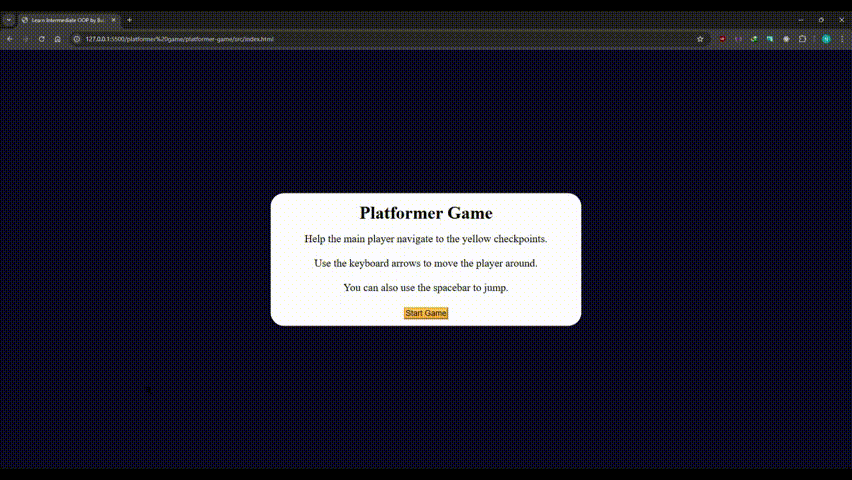

# platformer-game

## Features
- **Player Movement**: Use arrow keys to move and spacebar to jump.
- **Platforms**: Dynamic platforms that serve as obstacles and navigation aids.
- **Checkpoints**: Reach designated checkpoints to progress through the game.
- **Responsive Design**: Scales across various screen sizes.
- **Gravity and Collision Detection**: Realistic physics simulation.

## Getting Started

### Installation

1. Clone the repository or download the project files.

2. Open the index.html file in a browser to start the game.

### Controls
- Move Left: Press the left arrow key.
- Move Right: Press the right arrow key.
- Jump: Press the spacebar or up arrow key.

### Player Class:
- Represents the player character.
- Handles movement, gravity, and collisions with platforms and canvas boundaries.

### Platform Class:
- Represents the platforms the player can jump onto.
- Dynamically positioned and rendered.

### Checkpoint Class:
- Represents checkpoints that players must reach to progress.
- Includes logic to detect when a checkpoint is reached.

### Game Loop:
- Uses `requestAnimationFrame` to create a smooth animation cycle.
- Updates player position, platform positions, and checks for collisions.

## Demo

Below is a demo of p;atformer game in action:

---